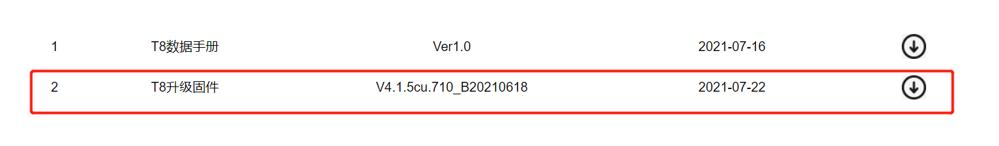
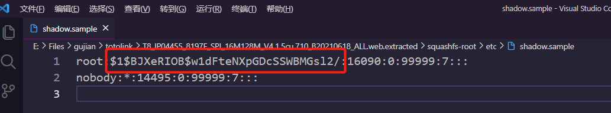

# root硬编码的密码

## T8_Firmware版本

V4.1.5cu.710_B20210618

## 描述:

root用户有一个硬编码的密码在 /etc/shadow.sample文件中

## 来源:

你可以从这个官网链接得到固件 : https://www.totolink.cn/home/menu/detail.html?menu_listtpl=download&id=18&ids=36

## 分析:

将密码解密后得到 cs2012

